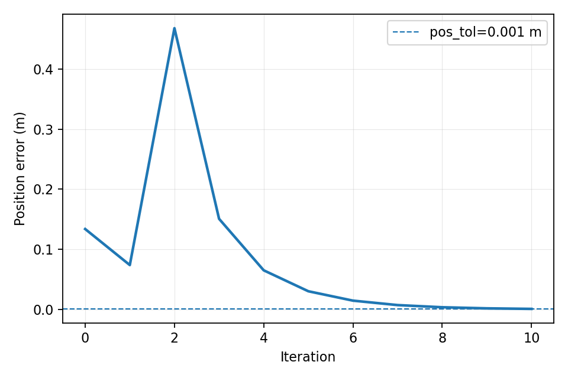
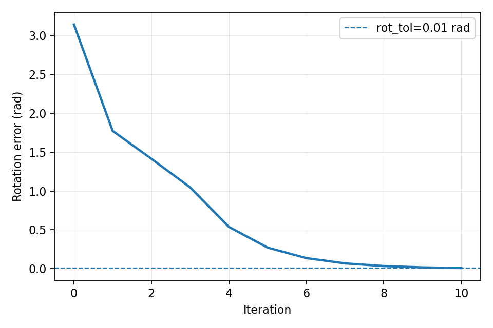
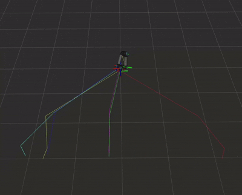

# ros2_6dof_arm_control

  

  <b>ROS 2 (Jazzy) simulated 6-DOF arm control pipeline</b> 
  Custom IK + trajectory generation • ros2_control • Gazebo (gz sim) • RViz

  
  

---

## What this project does

This repository implements a ROS 2 (Jazzy) workspace that can simulate and command a UR5-style 6-DOF arm through a
deliberately explicit pipeline from Cartesian pose targets to a `trajectory_msgs/JointTrajectory` executed by `ros2_control`.

Concrete capabilities:

- Gazebo (gz sim) simulation bringup via `ros_gz_sim` and `gz_ros2_control`, including `/clock` bridging and robot spawning.
- Robot description in Xacro/URDF with meshes, used consistently across Gazebo and RViz.
- Controller configuration for `joint_state_broadcaster` and `joint_trajectory_controller`.
- C++ nodes that:
  - solve inverse kinematics with damped least squares using a KDL chain built from `robot_description`
  - enforce joint limits and simple velocity constraints
  - generate time-parameterized joint trajectories and publish them to a controller topic
- Demo applications: a pick-and-place style target sequence runner and a Cartesian circle waypoint generator.
- Visualization helpers: RViz launch and nodes/scripts for plotting joint trajectories and end-effector trails.

## What this project explicitly does NOT do

This repository keeps scope intentionally narrow. It does not include:

- Collision checking or motion planning (no MoveIt2 planning pipeline).
- Execution on real hardware (no drivers, calibration, safety interlocks, or hardware interfaces).
- Dynamics identification or torque/impedance control (position-trajectory execution only).
- Perception (no camera/LiDAR integration, object detection, or grasp planning).
- A full task-level autonomy stack (no behavior trees, state machines, or scene management).

---

## Packages

- `arm_description`: Xacro/URDF + meshes for the UR5-style arm (including sim-oriented `ros2_control` configuration).
- `arm_control`: controller configuration (`joint_state_broadcaster`, `joint_trajectory_controller`).
- `arm_bringup`: launch files and Python utilities to start simulation, bridge time, spawn the robot, and start RViz.
- `arm_apps`: C++ nodes for IK, trajectory generation, demo sequencing, and visualization.

---

## Tech Stack

- ROS2 (Jazzy)
- C++ (`rclcpp`) + Python (`rclpy`)
- Gazebo (`gz sim`)
- `ros2_control` + `ros2_controllers`
- RViz2

---

## Quantitative evaluation (IK convergence)

This repository includes one reproducible quantitative artifact measuring **Damped Least Squares (DLS) IK convergence**.
For a fixed initial joint configuration and fixed Cartesian target pose, the solver logs the **end-effector position error norm** (meters) per iteration.
The solver also logs the **end-effector rotation error** (radians).

Generate the raw data (CSV):

    source /opt/ros/$ROS_DISTRO/setup.bash
    colcon build --symlink-install
    source install/setup.bash

    # Writes timestamped CSVs under docs/evaluation/
    ros2 launch arm_bringup ik_convergence_eval.launch.py

Generate the plots (PNG):

### Reads the latest timestamped CSVs from docs/evaluation/ and writes matching PNGs
  python3 scripts/plot_ik_convergence.py

Notes:

- The plots require matplotlib (Ubuntu: `sudo apt install -y python3-matplotlib`).
- Pandas is optional; the script will fall back to the stdlib CSV reader if pandas is not installed.

Example output plots (committed sample run):

  
  

Interpretation (for the sample run above): the solver converges in 10 iterations to 0.000944 m position error (< 0.001 m tol) and 0.00863 rad rotation error (< 0.01 rad tol). This demonstrates convergence for one fixed pose target; it is not a global guarantee over all poses.

---

## Build

### Requirements

- Linux (tested on Ubuntu 24.04)
- ROS2 **Jazzy** (Ubuntu 24.04)

### Build

    # 1) Source your ROS distro
    source /opt/ros/$ROS_DISTRO/setup.bash

    # 2) System tools
    sudo apt update
    sudo apt install -y \
      python3-rosdep \
      python3-colcon-common-extensions \
      python3-vcstool

    # 3) rosdep (first time only)
    sudo rosdep init || true
    rosdep update

    # 4) Install package dependencies
    cd /path/to/ros2_6dof_arm_control
    rosdep install --from-paths src --ignore-src -r -y

    # 5) Build
    colcon build --symlink-install

    # 6) Source overlay
    source install/setup.bash

---

## Demos

All demo launch files live in `arm_bringup`.

---

### Pick & Place

Starts Gazebo simulation, spawns the UR5, ensures controllers are active,
runs `go_to_pose_node`, and executes a predefined target sequence.

<table>
<tr>
<td width="50%" valign="top">
<pre><code>source /opt/ros/$ROS_DISTRO/setup.bash
source install/setup.bash

ros2 launch arm_bringup pick_and_place.demo.launch.py
</code></pre>
</td>
<td width="50%" align="center" valign="top">

</td>
</tr>
</table>

  (GitHub Mobile/App: GIF may not load) <a href="media/pick_and_place.gif">Open Pick &amp; Place GIF</a>

---

### Cartesian circle (draw_circle_cartesian)

Runs a Cartesian circle by generating TCP waypoints and solving IK for each point.

<table>
<tr>
<td width="50%" valign="top">
<pre><code>source /opt/ros/$ROS_DISTRO/setup.bash
source install/setup.bash

ros2 launch arm_bringup \\
circle_cartesian.demo.launch.py
</code></pre>
<strong>Optional arguments:</strong>
<pre><code>ros2 launch arm_bringup \
circle_cartesian.demo.launch.py \
  radius:=0.18 plane:=xy loops:=2 \
  num_points:=80 point_duration:=0.30
</code></pre>
</td>
<td width="50%" align="center" valign="top">

</td>
</tr>
</table>

  (GitHub Mobile/App: GIF may not load) <a href="media/circle_cartesian.gif">Open Cartesian Circle GIF</a>

---

### Joint trajectory visualization

Publishes RViz `visualization_msgs/Marker` traces for joint trajectories.

    

<table>
<tr>
<td width="50%" valign="top">
<pre><code>source /opt/ros/$ROS_DISTRO/setup.bash
source install/setup.bash
ros2 launch arm_bringup \
joint_traj_viz.launch.py
</code></pre>
</td>
<td width="50%" align="center" valign="top">

</td>
</tr>
</table>

  (GitHub Mobile/App: GIF may not load) <a href="media/trajectory_plotting.gif">Open Trajectory Plotting GIF</a>

---

### RViz (optional)

Starts RViz2 with a preconfigured visualization.

    source /opt/ros/$ROS_DISTRO/setup.bash
    source install/setup.bash

    ros2 launch arm_bringup rviz.launch.py

Optional plotting:

    ros2 launch arm_bringup rviz.launch.py use_rqt_plot:=true plot_joint_count:=6

---

### One-shot pose command (CLI)

When `go_to_pose_node` is running:

    ros2 run arm_apps go_to_pose \
      --x 0.45 --y 0.15 --z 0.25 \
      --roll 0 --pitch 0 --yaw 0

---

## Architecture Overview

### Node graph (high level)

    Gazebo (gz sim)
      │
      ├── ros_gz_bridge  ───────────────►  /clock
      │
      └── gz_ros2_control
             │
             ├── controller_manager
             │     ├── joint_state_broadcaster
             │     └── joint_trajectory_controller
             │
             └── ensure_controllers_active

    go_to_pose_node
      ├── IK (Damped Least Squares)
      ├── Joint limits & velocity constraints
      └── JointTrajectory → controller

    joint_trajectory_viz_node → RViz markers
    robot_state_publisher → /tf

---
