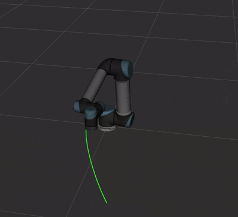

# ros2_6dof_arm_control

  

  <b>ROS2-based 6-DOF robotic arm control stack</b> 
  Inverse Kinematics • Trajectory Planning • ros2_control • Gazebo • RViz

  
  
  

---

## Overview

**ros2_6dof_arm_control** is a ROS2-based control stack for a 6-DOF robotic arm, focusing on
**Cartesian control, inverse kinematics, and trajectory execution** using `ros2_control`.

The project deliberately avoids high-level planners (e.g. MoveIt2) in favor of a
**transparent, end-to-end control pipeline**:
from Cartesian targets → IK → joint trajectories → controller execution.

> Planned first release tag: **v0.1-mvp**

---

## Why this project matters

This repository demonstrates a **full manipulation control pipeline implemented from scratch**:

- Cartesian motion generation
- Damped Least Squares inverse kinematics
- Joint limit & velocity enforcement
- Time-parameterized trajectories
- Deterministic execution via `ros2_control`

It is intended as a **learning-focused yet production-quality** foundation for
advanced manipulation topics such as MoveIt2, impedance control, and real hardware bringup.

---

## Key Features

- Inverse Kinematics (Damped Least Squares)
- Joint limits & velocity constraints
- Time-parameterized joint trajectories
- Pick & Place demo
- Cartesian circle (TCP waypoint) demo
- RViz visualization (TCP trails, joint trajectories)
- Gazebo simulation via `ros2_control`

---

## Tech Stack

- ROS2 (Jazzy / Humble)
- C++ (`rclcpp`) + Python (`rclpy`)
- Gazebo (`gz sim`)
- `ros2_control` + `ros2_controllers`
- RViz2

---

## Installation

### System requirements

- Linux (tested on Ubuntu 22.04 / 24.04)
- ROS2 **Humble** (Ubuntu 22.04) or **Jazzy** (Ubuntu 24.04)

### Build & setup (copy-paste ready)

    # 1) Source your ROS distro
    source /opt/ros/$ROS_DISTRO/setup.bash

    # 2) System tools
    sudo apt update
    sudo apt install -y \
      python3-rosdep \
      python3-colcon-common-extensions \
      python3-vcstool

    # 3) rosdep (first time only)
    sudo rosdep init || true
    rosdep update

    # 4) Install package dependencies
    cd /path/to/ros2_6dof_arm_control
    rosdep install --from-paths src --ignore-src -r -y

    # 5) Build
    colcon build --symlink-install

    # 6) Source overlay
    source install/setup.bash

---

## Demos

All demo launch files live in `arm_bringup`.

---

### Pick & Place

Starts Gazebo simulation, spawns the UR5, ensures controllers are active,
runs `go_to_pose_node`, and executes a predefined target sequence.

<table>
<tr>
<td width="50%" valign="top">
<pre><code>source /opt/ros/$ROS_DISTRO/setup.bash
source install/setup.bash

ros2 launch arm_bringup pick_and_place.demo.launch.py
</code></pre>
</td>
<td width="50%" align="center" valign="top">

</td>
</tr>
</table>

---

### Cartesian circle (draw_circle_cartesian)

Runs a Cartesian circle by generating TCP waypoints and solving IK for each point.

<table>
<tr>
<td width="50%" valign="top">
<pre><code>source /opt/ros/$ROS_DISTRO/setup.bash
source install/setup.bash

ros2 launch arm_bringup \\
circle_cartesian.demo.launch.py
</code></pre>
<strong>Optional arguments:</strong>
<pre><code>ros2 launch arm_bringup \
circle_cartesian.demo.launch.py \
  radius:=0.18 plane:=xy loops:=2 \
  num_points:=80 point_duration:=0.30
</code></pre>
</td>
<td width="50%" align="center" valign="top">

</td>
</tr>
</table>

---

### Joint trajectory visualization

Publishes RViz `visualization_msgs/Marker` traces for joint trajectories.

    source /opt/ros/$ROS_DISTRO/setup.bash
    source install/setup.bash

    ros2 launch arm_bringup joint_traj_viz.launch.py

---

### RViz (optional)

Starts RViz2 with a preconfigured visualization.

    source /opt/ros/$ROS_DISTRO/setup.bash
    source install/setup.bash

    ros2 launch arm_bringup rviz.launch.py

Optional plotting:

    ros2 launch arm_bringup rviz.launch.py use_rqt_plot:=true plot_joint_count:=6

---

### One-shot pose command (CLI)

When `go_to_pose_node` is running:

    ros2 run arm_apps go_to_pose \
      --x 0.45 --y 0.15 --z 0.25 \
      --roll 0 --pitch 0 --yaw 0

---

## Architecture Overview

### Node graph (high level)

    Gazebo (gz sim)
      │
      ├── ros_gz_bridge  ───────────────►  /clock
      │
      └── gz_ros2_control
             │
             ├── controller_manager
             │     ├── joint_state_broadcaster
             │     └── joint_trajectory_controller
             │
             └── ensure_controllers_active

    go_to_pose_node
      ├── IK (Damped Least Squares)
      ├── Joint limits & velocity constraints
      └── JointTrajectory → controller

    joint_trajectory_viz_node → RViz markers
    robot_state_publisher → /tf

---

## Results

- Fast IK convergence for reachable targets
- Smooth, time-parameterized joint motion
- Deterministic execution via ros2_control
- Clear visualization and debugging in RViz

---

## Roadmap

- MoveIt2 integration
- Impedance / admittance control
- Collision-aware planning
- Real hardware support

---

## CV / Portfolio bullets

- Developed a ROS2-based 6-DOF robotic arm control stack with inverse kinematics,
  joint-limit enforcement, and trajectory planning.
- Designed a modular ROS2 architecture with Gazebo and RViz integration,
  enabling reproducible simulation and motion-quality evaluation.
